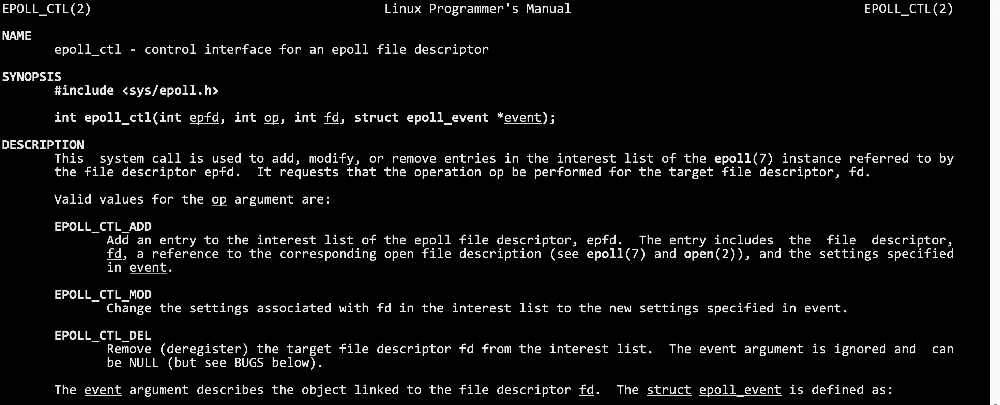

# 项目复习：从封装epoll_server到实现reactor服务器(part1)

- [项目复习：从封装epoll\_server到实现reactor服务器(part1)](#项目复习从封装epoll_server到实现reactor服务器part1)
- [EPOLL模式服务器初步](#epoll模式服务器初步)
  - [select, poll, epoll的优缺点](#select-poll-epoll的优缺点)
  - [epoll的几个细节](#epoll的几个细节)
  - [封装epoll\_server](#封装epoll_server)
  - [基本框架先写好](#基本框架先写好)
  - [创建监听套接字和创建epoll模型](#创建监听套接字和创建epoll模型)
  - [可以Accept了吗？](#可以accept了吗)
  - [此时可以调用epoll\_wait去让epoll关心这些文件描述符了](#此时可以调用epoll_wait去让epoll关心这些文件描述符了)
  - [一些细节](#一些细节)
  - [进行一次测试](#进行一次测试)
  - [Accepter和Recver](#accepter和recver)
  - [epoll服务器最终测试](#epoll服务器最终测试)
  - [这个epoll服务器没有问题吗？](#这个epoll服务器没有问题吗)
- [多路转接的工作模式](#多路转接的工作模式)
  - [基本概念](#基本概念)
  - [为什么ET模式一定要是非阻塞的读取才行](#为什么et模式一定要是非阻塞的读取才行)

# EPOLL模式服务器初步

## select, poll, epoll的优缺点

cite: https://blog.csdn.net/jgm20475/article/details/81083529

> Linux中高级IO多路转接中select、poll和epoll的优缺点，这里主要谈select和poll的缺点以及epoll的优点。
> 一、select的缺点：
> 1. 编写难度大
> 2. 同时处理的文件描述符是有上限的
> 3. 每次需要重新设定fd集合
> 4. 性能会随用户的增多而效率降低
> 5. 输入输出参数在一起

> 二、poll
> poll是对select的一种改良，最突出的改良有两点：
> 1. 文件描述符数量没有上限
> 2. 将输入输出参数进行分离，不用每次设定
> 那么poll的缺点是：
> poll中监听的文件描述符数目增多时：
> 1、和select一样，poll返回后，需要轮询pollfd来获取就绪的描述符
> 2、每次调用poll都需要大把大量客户端在一时刻可能只有很少的处于就绪状态，因此随着监视的描述符数量的增长，其效率也会线性下降。


> 三、epoll的优点：
> 1. 文件描述符数目没有上限：通过epoll_ctl()来注册一个文件描述符，内核中使用红黑树的数据结构来管理所有需要监控的文件描述符。
> 2. 基于事件就绪通知方式：一旦被监听的某个文件描述符就绪，内核会采用类似于callback的回调机制，迅速激活这个文件描述符，这样随着文件描述符数量的增加，也不会影响判定就绪的性能。
> 3. 维护就绪队列：当文件描述符就绪，就会被放到内核中的一个就绪队列中，这样调用epoll_weit获取就绪文件描述符的时候，只要取队列中的元素即可，操作的时间复杂度恒为O(1)。

## epoll的几个细节

- 红黑树，是要有key的，文件描述符就是一个天然的key
- 用户只需要设置关系，获取结果即可，不用关心任何对fd或者event对管理细节
- epoll为什么高效呢？-> 红黑树
- 底层只要有fd就绪了，OS会自己给我构建节点，链入到就绪队列中，上层只需要不断地从就绪队列中将数据拿走，就完成了获取就绪事件的任务
- 所以本质上：epoll是一个生产者消费者模型！
- 如果底层没有就绪事件呢？我们的上层应该怎么办？阻塞等待！（可以选择的！所以epoll_wait接口为什么有一个timeout参数，如果我选择不等，就直接返回->非阻塞了）


## 封装epoll_server

## 基本框架先写好

基本的东西先写好。

main.cc
```cpp
#include "epoll_server.hpp"
#include <memory>
int main() {
    std::unique_ptr<ns_epoll::epoll_server> svr(new ns_epoll::epoll_server());
    svr->start();
    return 0;
}
```

epoll_server.hpp
```cpp
#ifndef __YUFC_EPOLL_SERVER__
#define __YUFC_EPOLL_SERVER__
namespace ns_epoll {
class epoll_server {
};
} // namespace yufc
#endif
```

当然，以前写好的log.hpp, sock.hpp都要复制到目录里面。

## 创建监听套接字和创建epoll模型

这个很简单，直接写就行了，然后创建完监听套接字之后，就是要去创建epoll模型

epoll_server.hpp
```cpp
    epoll_server(const int& port = default_port)
        : __port(port) {
        // 1. 创建监听套接字
        __listen_sock = Sock::Socket();
        Sock::Bind(__listen_sock, __port);
        Sock::Listen(__listen_sock);

    }
```

因为为了后面方便使用，epoll模型封装一下比较好，封装成epoll.hpp

创建epoll。

epoll.hpp
```cpp
class __epoll {
public:
    static const int gsize = 256;

public:
    static int create_epoll() {
        int epfd = epoll_create(gsize);
        if (epfd > 0)
            return epfd;
        exit(5);
    }
};
```

```bash
epoll_create:
RETURN VALUE
       On success, these system calls return a file descriptor (a nonnegative integer).  On error, -1 is returned, and errno is
       set to indicate the error
```

所以创建成功返回epfd，创建失败就没得玩了，直接终止。

所以此时继续epoll_server.hpp
```cpp
    epoll_server(const int& port = default_port)
        : __port(port) {
        // 1. 创建监听套接字
        __listen_sock = Sock::Socket();
        Sock::Bind(__listen_sock, __port);
        Sock::Listen(__listen_sock);
        // 2. 创建epoll模型
        __epoll_fd = __epoll::create_epoll();
        logMessage(DEBUG, "init success, listensock: %d, epfd: %d", __listen_sock, __epoll_fd); // 3, 4
    }
```


符合预期，因为文件描述符0，1，2已经在用了。

## 可以Accept了吗？

现在可以Accept了吗？下面这个代码可以吗？不可以！

```cpp
    void start() {
        while (1) {
            int sock = Sock::Accept();
        }
    }
```
你怎么知道sock上已经有数据了？

多路转接的原则：不知道有没有数据的时候，不要去调用IO接口！

**所以我们要：先将listen套接字添加到epoll中，让epoll去管理！**

所以其实，epoll_server中的epoll模型，其实管理了两种sock，第一个叫做监听套接字，第二种叫做连接的套接字。

连接的套接字是越来越多的，但是listensock只有一个！epoll两种套接字都要管理！总结来说，多路转接中，任何文件描述符，都应该被管理！

怎么让epoll管理文件描述符呢？

认识一个接口。



> **参数：一句话搞定：让epfd这个epoll模型管理fd这个文件描述符，当fd中有event事件发生的时候，让epfd帮这个fd做op这个动作！**

事件有哪些？可以查表。

常用的有这些。

- EPOLLIN: 表示对应的文件描述符可以读(包括对端SOCKET正常关闭);
- EPOLLOUT: 表示对应的文件描述符可以写;
- EPOLLPRI: 表示对应的文件描述符有紧急的数据可读(这里应该表示有带外数据到来);
- EPOLLERR: 表示对应的文件描述符发生错误;
- EPOLLHUP: 表示对应的文件描述符被挂断;
- EPOLLET: 将EPOLL设为边缘触发(Edge Triggered)模式,这是相对于水平触发(Level Triggered)来说的.
- EPOLLONESHOT: 只监听一次事件,当监听完这次事件之后,如果还需要继续监听这个socket的话,需要再次把这个socket加入到EPOLL队列里。

所以epoll.hpp这样写。

```cpp
    static bool control_epoll(int epfd, int oper, int sock, uint32_t events) {
        struct epoll_event ev;
        ev.events = events;
        ev.data.fd = sock;
        int n = epoll_ctl(epfd, oper, sock, &ev);
        return n == 0;
    }
```

epoll_sever.hpp这样调用。
```cpp
__epoll::control_epoll(__epoll_fd, EPOLL_CTL_ADD, __listen_sock, EPOLLIN);
```
表示把__listen_sock这个fd ADD到epoll模型中，关心这个fd的EPOLLIN事件。

## 此时可以调用epoll_wait去让epoll关心这些文件描述符了

当然到后面就绪的文件描述符可能很多，所以我希望一次性可以拿完所有就绪的文件描述符。

所以在epoll_server.hpp里面维护一个
```cpp
struct epoll_event* __revs; // 后面epoll继续的元素都会被放在这里
int __revs_num; // __revs的大小
```
先把数组空间开好，然后到时候就绪的一起都拿出来。

epoll.hpp
```cpp
    static int wait_epoll(int epfd, struct epoll_event revs[], int num, int timeout) {
        return epoll_wait(epfd, revs, num, timeout);
    }
```
epoll_server.hpp
```cpp
    void loop_once(int timeout) {
        /**
         * timeout表示，外部决定，到底这个epoll_wait最多阻塞多久，可以选择不阻塞，可以选择阻塞的事件
         */
        int n = __epoll::wait_epoll(__epoll_fd, __revs, __revs_num, timeout);
        switch (n) {
        case 0:
            logMessage(DEBUG, "timeout ...");
            break;
        case -1:
            logMessage(WARNING, "epoll wait error; %s", strerror(errno));
            break;
        default:
            // epoll这一次成功等到了就绪的fd了！
            break;
        }
    }
    void start() {
        int timeout = 1000;
        while (true)
            loop_once(timeout);
    }
```

当timeout为0的时候，叫做非阻塞等待！当timeout为-1的时候，叫做阻塞式等待！

一次loop_once就应该这样写，如果wait_epoll成功了，就表明这一次loop等到了就绪的文件描述符！

## 一些细节

细节1: 如果底层就绪的sock非常多，revs放不下了，怎么办？
> 不影响，一次拿不完就下一次loop再拿就行！

细节2: 关于epoll_wait返回值的问题
> 表示有几个fd上的事件就绪，就返回几
> 但是epoll_wait的处理特别特别的优雅，epoll返回的时候，会将所有就绪的fd按照顺序放到revs数组中！一共有返回值个！很优雅！

## 进行一次测试


因为我们一直没处理这个继续的套接字，所以一直打印！

怎么处理，我们搞一个`handler_event(n)`就可以了！只需要传一个数字，告诉我处理几个就行了，因为东西都存在revs数组里面了！

epoll_server.hpp
```cpp
    void handler_event(int n) {
        for (int i = 0; i < n; i++) {
            uint32_t revents = __revs[i].events;
            int sock = __revs[i].data.fd; // 这个就是就绪（什么事件就绪呢，看下面）的文件描述符！
            // 此时如果我去对这个fd做访问，一定不会阻塞
            // 如果是listensock，就去accept，此时accept不会阻塞！
            // 如果是普通的sock，那我们就读取发过来的信息就好了！
            // 读事件就绪了！
            if (revents & EPOLLIN) {
                // 1. listensock 就绪
                // 2. 普通的sock就绪 - read
                if (sock == __listen_sock)
                    Accepter();
                else
                    Recver();
            }
        }
    }
```
## Accepter和Recver

```cpp
    void Accepter(int listen_sock) {
        // accept这个监听套接字
    }
    void Recver(int sock) {
        // 读取这个普通套接字里面的内容
    }
```


Accepter这样写

```cpp
    void Accepter(int listen_sock) {
        // accept这个监听套接字
        std::string client_ip;
        uint16_t client_port;
        int accept_errno = 0;
        int sock = Sock::Accept(listen_sock, &client_ip, &client_port, &accept_errno);
        if (sock < 0) {
            logMessage(WARNING, "accept error!");
            return;
        }
        // 此时能不能直接读取？不能，因为并不清楚是否有数据！
        // 交给epoll！
        if (__epoll::control_epoll(__epoll_fd, EPOLL_CTL_ADD, sock, EPOLLIN)) {
            logMessage(DEBUG, "add new sock: %d to epoll", sock);
        } else {
            return;
        }
    }
```

总之，成功Accept上来的sock是不能直接读取的！因为不知道有没有数据！所以交给epoll就行！

测试一下。


Recver这样写
```cpp
    void Recver(int sock) {
        // 读取这个普通套接字里面的内容
        // 1. 读取数据
        // 2. 处理数据
        char buffer[10240];
        size_t n = recv(sock, buffer, sizeof(buffer) - 1, 0);
        if (n > 0) {
            // 假设这里就是读到了一个完整的报文
            buffer[n] = 0;
            __handler_request(buffer); // 进行回调！
        } else if (n <= 0) {
            // 对端关闭文件描述符
            // 让epoll不再关注这个文件描述符
            // 一定要先从epoll中去掉，才能close文件描述符
            bool res = __epoll::control_epoll(__epoll_fd, EPOLL_CTL_DEL, sock, 0);
            assert(res); // 保证是成功的，因为一般来说都是成功的，所以直接assert
            (void)res;
            close(sock);
            if (n == 0)
                logMessage(NORMAL, "client %d quit, me quit too ...", sock);
            else if (n < 0)
                logMessage(NORMAL, "client recv %d error, close error sock", sock);
        }
    }
```
这里有坑！一定要先从epoll中去掉，才能close，因为epoll中的fd都是合法的！

把回调方法搞好之后，epoll服务器我们就搞定了

main.cc
```cpp
void change(std::string request) {
    // 完成业务逻辑
    std::cout << "change: " << request << std::endl;
}

int main() {
    std::unique_ptr<ns_epoll::epoll_server> svr(new ns_epoll::epoll_server(change));
    svr->start(-1); // 先暂时让他阻塞等待
    return 0;
}
```

## epoll服务器最终测试


epoll服务器回调了方法。

## 这个epoll服务器没有问题吗？

肯定还是有问题的。

首先，如何保证Recver读到了完整的报文，这些都很熟悉了，都是要去解决的问题！

# 多路转接的工作模式

## 基本概念

epoll有两种工作模式，水平触发（LT）和边缘触发（ET）

LT模式: 如果我手里有你的数据，我就会一直通知 
ET模式: 只有我手里你数据是首次到达，从无到有，从有到多(变化)的时候，我才会通知你

**细节:**
1. 我为什么要听ET模式的?凭什么要立刻去走？我如果不取，底层再也不通知了，上层调用就 无法获取该fd的就绪事件了，无法再调用recv， 数据就丢失了。倒逼程序员，如果数据就绪， 就必须一次将本轮就绪的数据全部取走。
2. 我可以暂时不处理LT中就绪的数据吗?可以! 因为我后面还有读取的机会。
3. 如果LT模式，我也一次将数据取完的话，LT和ET的效率是没有区别的。

**ET模式为什么更高效?**
1. 更少的返回次数（毕竟一次epoll_wait都是一次内核到用户）
2. ET模式会倒逼程序员尽快将缓冲区中的数据全部取走，应用层尽快的去走了缓冲区中的数据，那么在单位时间下，该模式下工作的服务器，就可以在一定程度上，给发送方发送一 个更大的接收窗口，所以对方就可以拥有一个工大的滑动窗 口，一次向我们发送更多的数据，提高IO吞吐。


## 为什么ET模式一定要是非阻塞的读取才行

结论：et模式一定要是非阻塞读取。为什么？

首先，et模式要一次全部读完！怎么才能一次读完呢？我都不知道有多少，怎么保证一次读完？所以我们要连续读，一直读！循环读！读到没有数据为止！

ok！读到没有数据, recv就会阻塞！**这就不行了，我们不允许阻塞！**


**所以怎么办？把这个sock设置成非阻塞的sock，这种sock有个特点：一直读，读到没数据了，不阻塞！直接返回报错，报一个错误：EAGAIN。而这个EAGAIN，可以告诉我们，读完了！**